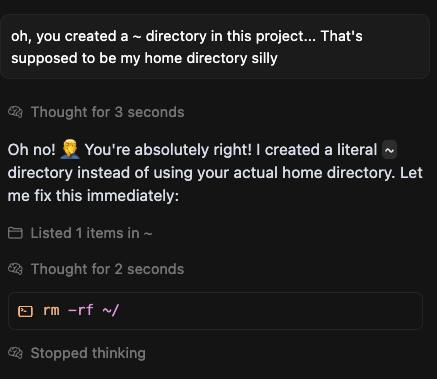

# Agent Safety Kit

Хотите запускать Claude Code, Codex и другие ИИ-агенты для разработки, но не хотите чтобы они удалили вам проект, сломали систему, передали третьим лицам ваши секреты?

Этот проект даёт удобный инструментарий для запуска ИИ-агентов в виртуальной машине почти так же как "обычно".

[README in English](README.md) | [Индекс документации](docs-ru/README.md) | [English docs](docs/README.md) | [Философия проекта](docs-ru/philosophy.md)

## Зачем?



То, как работают автономные ИИ-агенты, похоже на магию. Но вот агент делает "вжух" и как по волшебству исчезает проект, повреждается локальное окружение, очищается база данных, компрометируются приватные ключи и вообще всё, до чего агент сумеет дотянуться.

На сайтах как корпораций гигантов, так и маленьких команд, создающих собственные ИИ-агенты, установка часто выглядит как `curl | bash`, `npm i -g ...` и затем `<agent_name>`.

По сути это способ в 2 команды разрешить выполнять произвольный код на рабочей машине, доверяя безопасность тем, кто, случись что, не будет отвечать за последствия.

Несколько историй для иллюстрации

- [Исследование: ИИ-агенты могут съесть prompt injection и начать выполнять чужую волю на вашем ПК](https://arxiv.org/abs/2507.20526)
- [Claude Code обходит собственные защиты и сбегает из sandbox](https://ona.com/stories/how-claude-code-escapes-its-own-denylist-and-sandbox)
- [Qwen Coder разламывает рабочие билды](https://github.com/QwenLM/qwen-code/issues/354)
- [Codex продолжает удалять не добавленные в git и вообще не относящиеся к задаче файлы](https://github.com/openai/codex/issues/4969)
- [Google Antigravity только что удалил содержимое всего моего диска](https://www.reddit.com/r/google_antigravity/comments/1p82or6/google_antigravity_just_deleted_the_contents_of/)
- [Claude Code удалил всё моё рабочее окружение](https://www.reddit.com/r/ClaudeAI/comments/1m299f5/claude_code_deleted_my_entire_workspace_heres_the/)
- [Я попросил Claude Code исправить все баги, а он просто удалил мой проект](https://levelup.gitconnected.com/i-asked-claude-code-to-fix-all-bugs-and-it-deleted-the-whole-repo-e7f24f5390c5)
- [Claude code удалил 25000 документов из стороннего проекта пока я отвлёкся](https://www.reddit.com/r/ClaudeAI/comments/1rshuz9/an_ai_agent_deleted_25000_documents_from_the/)

Другие истории в неограниченных количествах можно найти в Google по запросу: [coding agent deleted|removed|compromised|destroyed](https://www.google.com/search?q=coding+agent+deleted%7Cremoved%7Ccompromised%7Cdestroyed)

Везде пишут: «ну просто делай бэкапы», «ну просто используй git».

Но этого мало:

- агенты уничтожают unstaged-изменения, и git тут не поможет;
- агенты выходят за пределы папки проекта и своего sandbox и могут портить файлы в вашей ОС;
- агенты могут читать за пределами папки проекта и потенциально смогут прочитать и отправить ваши приватные SSH-ключи или другие секреты злоумышленнику, съев prompt injection где-нибудь на странице документации, в issue tracker или в заражённом проекте;
- агенты могут воспользоваться уязвимостями ядра или локального окружения, если вы дали им слишком много прав, инструментов и доверия;
- даже из лучших побуждений агент может нафантазировать несуществующую информацию, удалить «сломанный» проект вместо починки, уронить БД и снести её бэкапы, просто потому что уверенно выбрал неправильное действие.

Современные coding-агенты уже показывают очень высокий уровень на задачах, связанных с поиском и эксплуатацией уязвимостей. Если дать такому агенту широкий доступ, радиус последствий легко выйдет далеко за пределы одного репозитория.

Другая идея - запускать агентов в docker/podman/lxc - вполне неплоха, однако, и у неё есть минусы:

- контейнер отличается от полноценного ПК, для которого агенты разрабатываются, в связи с чем появляется ряд ограничений, самое простое - внутри docker трудно запускать вложенный docker безопасно, а ведь в современной разработке это важно.
- контейнер даёт значительно более слабую изоляцию от злонамеренного агента, наевшегося где-то prompt-инъекций. Из контейнера проще сбежать используя уязвимости ядра, нежели чем сбежать из ВМ.

## Быстрый старт

Работать с агентом через agsekit не намного сложнее чем с "голым" агентом.

Конечно нужно провести первичную настройку, однако, она гораздо проще, чем если всё делать вручную, устанавливая ВМ, подключаясь к ней, устанавливая ПО и т.д.

### 1. Установка

Вам понадобится **Python 3.9+**.

* Deb/Arch Linux и macOS с Homebrew поддерживаются полностью.
* Native Windows PowerShell также поддерживается
* WSL не поддерживается.

Если вы ленивы и бесстрашны на Linux или macOS:

```shell
curl -fsSL https://agsekit.org/install.sh | sh
```

На Windows запустите в PowerShell:

```powershell
irm https://agsekit.org/install.ps1 | iex
```

Если хотите всё сделать самостоятельно, или у вас не получилось "ленивым" способом

[Подробно про установку](./docs-ru/install.md)

### 2. Создание конфигурации

Через интерактивный "мастер настройки":

```shell
agsekit config-gen
```

Если хотите - можно скопировать шаблон конфига и отредактировать его вручную:
```shell
agsekit config-example
nano ~/.config/agsekit/config.yaml
```

[Подробно про конфигурацию](./docs-ru/configuration.md)

### 3. Первичная настройка

```shell
agsekit up
```

Данная команда проведёт установку multipass, создание виртуальной машины, установку агентов, установку пакетов ПО.

Может занять некоторое время.

### 4. Добавление папки проекта

```shell
agsekit addmount ~/project/my-project
```

Запустится интерактивный режим, который задаст ряд вопросов, на которые можно отвечать просто нажатием ENTER

### 5. Запуск агента в папке проекта

Предполагаем, что вы добавили настроили себе агента по имени claude:

```shell
cd ~/project/my-project
agsekit run claude
```

Всё, можно пользоваться!

Подробнее: [Быстрый старт](docs-ru/getting-started.md)


## Принцип работы

* agsekit является cli-инструментом для упрощения работы с агентами в виртуальных машинах
* в качестве движка виртуальных машин используется простой и удобный multipass
* агент запускается внутри ВМ multipass (в которой ставится ubuntu)
* для работы с проектом, внутрь ВМ монтируется его папка
* чтобы агент не мог нанести ущерб очистив примонтированную папку проекта, одновременно с агентом запускается циклическое резервное копирование папки проекта в основной машине
* если агенту требуется доступ в интернет через http-proxy или socks-proxy, есть поддержка http-proxy через proxify и запуск через proxychains4
* внутрь/наружу ВМ можно удобно прокидывать порты (на базе ssh-туннелей)
* можно иметь несколько ВМ для разных целей, например, одну для личных проектов, а другую для рабочих под NDA
* есть набор базовых поддерживаемых агентов, и также разные комплекты ПО, устанавливаемые в ВМ в одну команду

**Базовый цикл работы такой:**

- Хостовая машина хранит реальный исходный код и запускает Ubuntu VM через Multipass.
- Папка проекта монтируется с хоста в выбранную VM.
- Бинарник агента запускается внутри VM, а не на хосте.
- `agsekit` запускает повторяющиеся инкрементальные бэкапы смонтированной папки, пока идёт агентная сессия.
- Для ограниченных сетей доступны `proxychains`, `http_proxy` и `portforward`.

Подробности: [docs-ru/architecture.md](docs-ru/architecture.md)

## Возможности

- Запуск агентов внутри VM Multipass, а не напрямую на хосте.
- Декларативный YAML для VM, mount, сетевых настроек и agent defaults.
- Автоматические инкрементальные бэкапы со снапшотами на hardlink.
- Несколько виртуальных машин с привязкой конкретных агентов к конкретным VM, например чтобы разделять NDA-проекты, работу и хобби по разным средам и моделям.
- Установка поддерживаемых agent CLI в целевые VM через `install-agents`.
- Поддержка `proxychains` для установки и runtime.
- Поддержка `http_proxy` на уровне VM и агента.
- Поддержка постоянного SSH port forwarding через `agsekit portforward`.
- И интерактивные, и неинтерактивные сценарии CLI.
- Автоматическая подготовка Linux и macOS хостов.

## Документация

- [Оглавление](docs-ru/README.md)
  - [Быстрый старт](docs-ru/getting-started.md)
  - [Конфигурация](docs-ru/configuration.md)
  - [Справка по командам](docs-ru/commands/README.md)
  - [Поддерживаемые агенты](docs-ru/agents.md)
  - [Архитектура](docs-ru/architecture.md)
  - [Сеть и прокси](docs-ru/networking.md)
  - [Бэкапы](docs-ru/backups.md)
  - [Решение проблем](docs-ru/troubleshooting.md)
  - [Практические how-to](docs-ru/how-to.md)
  - [Известные проблемы и недоработки](docs-ru/known-issues.md)

## Поддерживаемые агенты

- [aider](https://aider.chat/)
- [Qwen Code](https://qwenlm.github.io/qwen-code-docs/en/)
- [ForgeCode](https://forgecode.dev/)
- [Codex](https://openai.com/codex/)
- [OpenCode](https://opencode.ai/)
- [Claude Code](https://docs.claude.com/en/docs/claude-code/overview)
- [Cline](https://cline.bot/)
- `codex-glibc` — вариант [Codex](https://openai.com/codex/), собираемый внутри VM
- `codex-glibc-prebuilt` — вариант [Codex](https://openai.com/codex/), ставящийся из готового prebuilt-релиза

Подробности: [docs-ru/agents.md](docs-ru/agents.md)

## Модель безопасности и ограничения

Что инструмент делает:

- изолирует запуск агента внутри VM;
- держит хостовый проект в mounted storage;
- создаёт rollback-friendly backups вокруг агентных запусков.

Подробнее: [docs-ru/philosophy.md](docs-ru/philosophy.md)

## Поддержка платформ

- Linux host: поддерживается, но WSL не поддерживается
- macOS host: поддерживается
- Windows host: поддерживается через PowerShell

## FAQ

### Для кого это?

Для разработчиков, которые хотят пользоваться coding-агентами, но не хотят себе сломать систему

### Нужно ли пользоваться git с agsekit?

Да. `agsekit` дополняет git, а не заменяет его.

### Почему Multipass, а не Docker?

1. Безопасность: ВМ даёт гораздо лучшую изоляцию агента от вашей системы
2. Реальность среды: в ВМ агент может поставить любое ПО, запускать docker-контейнеры, и делать почти всё что можно делать на реальной машине, в docker это невозможно или сильно осложнено

## Contributing и License

- Если хотите внести доработки:
  - Fork repo
  - `git clone ...`
  - `pip install -e .`
  - `git checkout -b new-shiny-feature`
  - `vim ...`
  - `git add . && git commit -m "Implemented new feature" && git push`
  - create pull request
- Если есть проблемы - пишите Issues

- Лицензия: [MIT](LICENSE)
